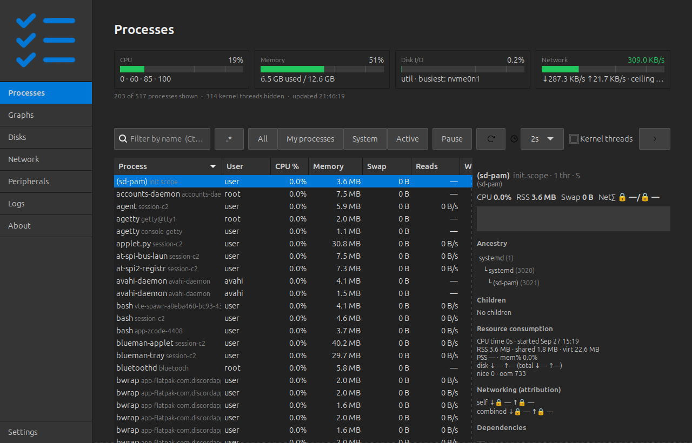
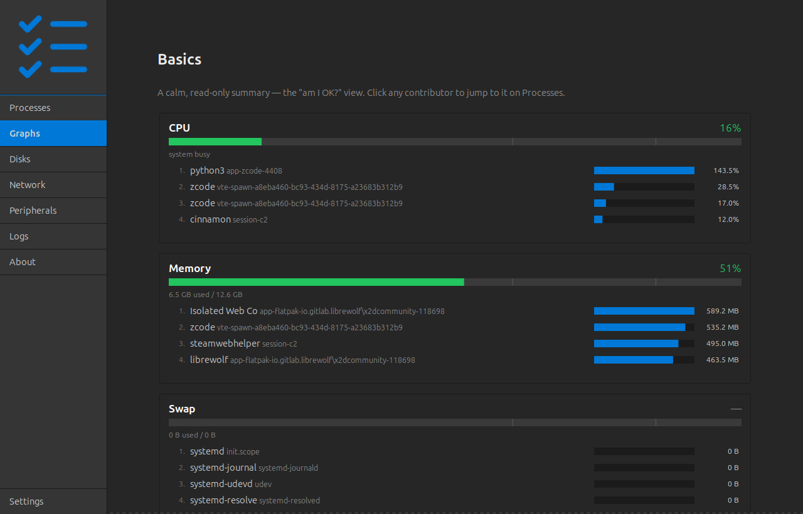
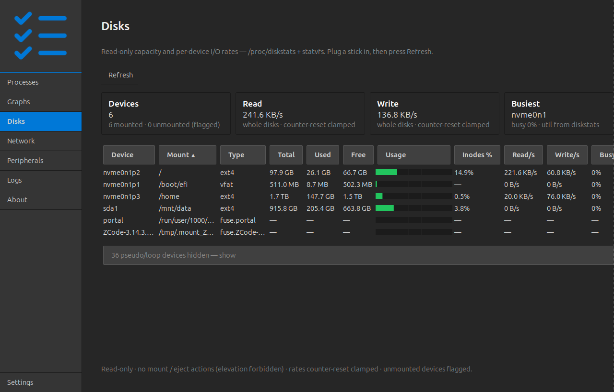
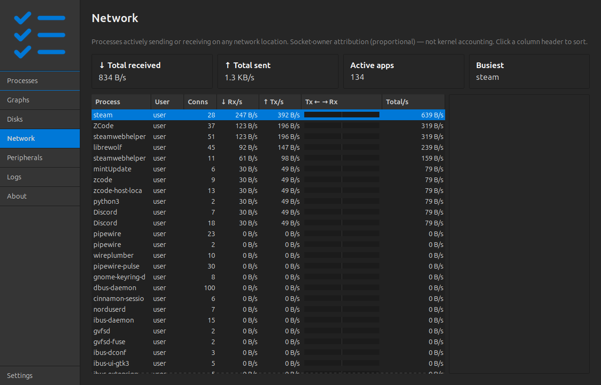
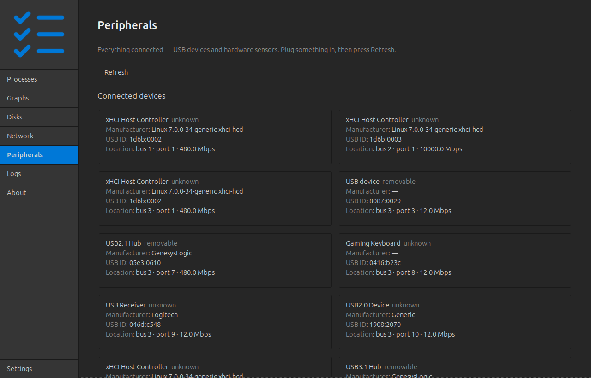
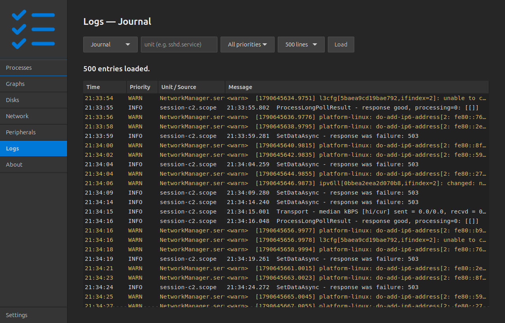
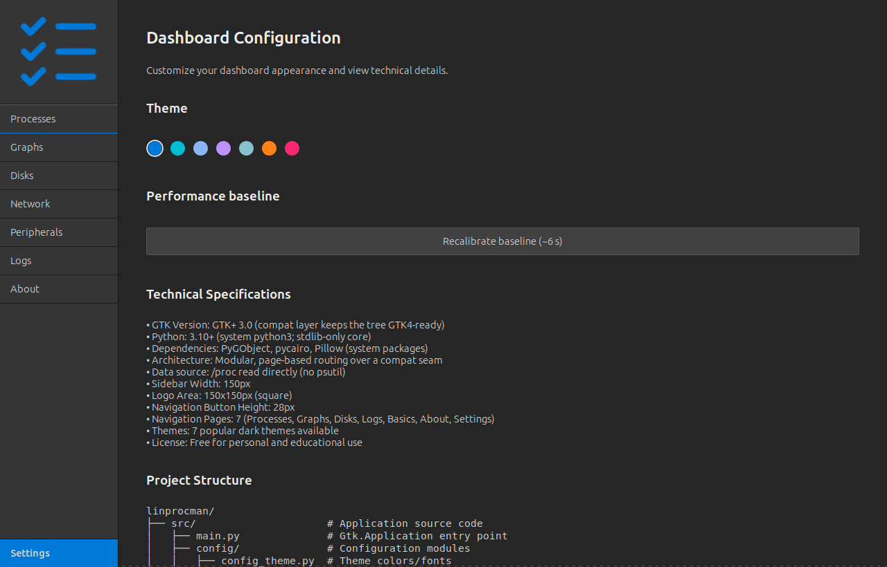
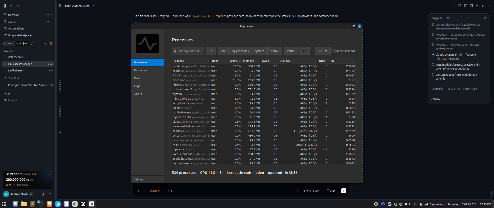

# Linux Process Manager Project

A native Linux process manager for Debian-based desktops (Mint first):
live process table and tree, signals and renice, resource history, PSI,
and a searchable, organizable systemd-journal log viewer with pattern
frequency analysis. GTK3 + Python, fully offline.

**Status:** in development (Phase 2 of 8 — data core and sampler shipped;
live table landing; logs and frequency analysis designed). Docs are the
contract: what's described there is what gets built and tested.

## What it does

**LinProcessManager** is a desktop process manager and system monitor for
Linux — everything in one window, fully offline, no root required:

- **Live process table** — every process, updated in place; filter by name
  (plain or regex), scope to your own processes, hide kernel threads.
- **25 sortable columns** — CPU, memory, swap, per-process disk I/O and
  network rates, threads, nice, OOM score, start time, cgroup unit and
  more; pick your columns with a right-click on the headers.
- **Signals and priorities** — Stop, Continue, End, Kill, any signal from a
  picker; renice presets; CPU affinity. Destructive actions confirm inline
  and the app **verifies the outcome** and reports it.
- **Group termination** — end or kill a process and its entire descendant
  tree, with per-step verification.
- **Process preview sidebar** — ancestry, children, resource consumption,
  dependencies, and per-process network attribution for the selected row.
- **Graphs** — six system dashboards (CPU, Memory, Swap, Disk I/O,
  Network, Pressure, Load) with per-metric detail pages and 5-minute
  history, plus the **Basics** cards: a one-glance "am I OK?" view.
- **Disks** — per-filesystem capacity with zone-colored usage bars, inode
  pressure, and per-device read/write rates.
- **Network** — which apps are talking to the network right now, how much,
  and (tracked) whether their pattern is steady, bursty, or
  small-regular-upload.
- **Peripherals** — connected USB devices and hardware sensors
  (temperatures, fans, CPU frequency, GPU).
- **Logs** — the systemd journal with presets, unit/priority filters, and
  severity coloring (saved views and frequency analysis in development).

## Screenshots

All pages, captured live from the running application:

**Processes** — the live table, metric band, and the per-process preview
sidebar:



**Graphs** — the Basics summary cards and the chart hub:



**Disks** — capacity, usage bars, and per-device I/O:



**Network** — per-app traffic with the Tx←→Rx bars:



**Peripherals** — USB devices and hardware sensors:



**Logs** — the journal viewer:



**Settings** — interval, scope, and baseline recalibration:



## Requirements & compatibility

Built **Mint-first** on Linux Mint 22 (Ubuntu 24.04 base) — verified on
this machine — and designed to run on the whole Debian/Ubuntu family:

| Base (representative distros) | Python | GTK 3 | Confidence |
|---|---|---|---|
| Linux Mint 22 · Ubuntu 24.04 | 3.12 | 3.24.41 | **verified on this machine** |
| Linux Mint 21.x · Ubuntu 22.04 · Pop!_OS 22.04 | 3.10 | 3.24.33 | supported floor |
| Debian 12 · LMDE 6 | 3.11 | 3.24.3x | supported floor |
| Debian 13 · LMDE 7 | 3.13 | 3.24.4x | supported |

**Runtime needs are four system packages** — no pip, no venv, no compiled
components: `python3-gi`, `gir1.2-gtk-3.0`, `python3-cairo`, `python3-pil`
(Python ≥ 3.10). Fedora, Arch, and openSUSE ship the same stack and are
expected to work (untested — reports welcome).

Also by design: **fully offline** (reads `/proc`, `/sys`, and the local
`journalctl` — makes no network connections of its own), **unprivileged**
(no root, no elevation paths), and degrades visibly instead of crashing on
hardened kernels (hidepid, Yama, dmesg_restrict). Details and the version
matrix: [docs/debian-compatibility.md](docs/debian-compatibility.md).

## Principles (binding — docs/build-principles.md)

- **Fully offline.** Every datum from the local kernel (`/proc`, `/sys`)
  and local binaries (`journalctl`). No network, ever — enforced by test
  gates (AST import allowlist + subprocess argv allowlist).
- **Local assets only.** Icons are Phosphor (MIT), copied from the local
  master library into `resources/icons/` (manifest is the contract).
- **Modular and universal.** Core modules import no UI; runs on any
  Debian-based build (floors: docs/debian-compatibility.md); degrades
  visibly, never crashes, on hardened kernels (hidepid, Yama, dmesg_restrict).
- **Unprivileged.** No elevation paths, v1 and beyond.

## Quick start

```bash
./run.sh                 # == python3 src/main.py  (system python, no pip/venv)
```

System packages needed: `python3-gi gir1.2-gtk-3.0 python3-cairo python3-pil`.
Python floor: **3.10** (authoritative — dev machine runs 3.12; see docs/debian-compatibility.md §2).

## Development

```bash
python3 -m pytest tests/ -q        # unit + gate suite
python3 -m pytest -m live -q       # opt-in live-kernel tier
DISPLAY=:0 python3 tests/live_gui_walk.py   # live navigation walk + screenshots
```

Workflow, gates, task contracts, and the ZCode⇄Claude collaboration:
[docs/DEVELOPMENT.md](docs/DEVELOPMENT.md).

## Screenshots

**The live app** (Phase 2 — real process table; sidebar 170 px, mockup palette):



**Design mockups by feature** (HTML sources in [docs/mockups/](docs/mockups/index.html), each with rendered PNG):

| Feature | Mockup |
|---|---|
| Live process table + details pane (primary) | [A](docs/mockups/mockup-a-processes.png) |
| Process tree + kernel-thread grouping | [B](docs/mockups/mockup-b-tree.png) |
| Resources: per-core CPU, memory, network, PSI | [C](docs/mockups/mockup-c-resources.png) |
| Actions: kill / renice / signal / status results | [D](docs/mockups/mockup-d-actions.png) |
| Logs: journal view, search, follow | [E](docs/mockups/mockup-e-logs.png) |
| Logs: saved views + flags (organize) | [F](docs/mockups/mockup-f-views.png) |
| Logs: context menu + Frequency analytics | [G](docs/mockups/mockup-g-frequency.png) |
| Sidebar width study (170 px adopted) | [H](docs/mockups/mockup-h-sidebar.png) |
| Extended columns (22-metric chooser, I/O + net) | [I](docs/mockups/mockup-i-extended-columns.png) |
| Graphs hub + per-metric detail pages | [L](docs/mockups/mockup-l-graphs.png) |
| Process preview pane + context menu | [J](docs/mockups/mockup-j-preview-context.png) |

Feature-to-spec mapping lives in the module docs
([docs/modules/](docs/modules/)); mockups are the visual contract for each.

## User manual

**[docs/USER_MANUAL.md](docs/USER_MANUAL.md)** — the complete end-user
guide: every page, the right-click menus (signals, priorities, importance
marks, tracking), sorting and columns, the color system, keyboard
shortcuts, and troubleshooting.

## Documentation map

| Doc | What it holds |
|---|---|
| [docs/process-manager-concept.md](docs/process-manager-concept.md) | overview + module index + phased roadmap |
| [docs/build-principles.md](docs/build-principles.md) | binding mandates + compliance checklist |
| [docs/modules/](docs/modules/) | 10 module specs — the engineering contracts |
| [docs/mockups/](docs/mockups/index.html) | 8 UI mockups + rendered PNGs |
| [docs/executor-collaboration.md](docs/executor-collaboration.md) | ZCode⇄Claude Code build collaboration |
| [docs/gtk4-port.md](docs/gtk4-port.md) | GTK3→GTK4 port strategy |
| [docs/upgrade-architecture.md](docs/upgrade-architecture.md) | compat layer + upgrade runbooks |
| [docs/debian-compatibility.md](docs/debian-compatibility.md) | distro matrix, floors, packaging |
| [docs/modules/graphs-hub.md](docs/modules/graphs-hub.md) | Graphs sidebar feature: hub + per-metric chart pages |
| [docs/DEVELOPMENT.md](docs/DEVELOPMENT.md) | day-to-day development guide |
| [.zcode/tasks/QUEUE.md](.zcode/tasks/QUEUE.md) | orchestration queue + task states |

## License

LinProcessManager is released under the **Creative Commons
Attribution-NonCommercial 4.0 International** license (CC BY-NC 4.0, see
[LICENSE](LICENSE)).

You are welcome to **use, modify, and distribute** the application and its
source freely, for personal and non-commercial purposes — attribution is
appreciated. **Commercial use is not permitted without prior permission**
from the author (MensuraMedia); please reach out to discuss terms.

Icons: Phosphor, MIT —
see `resources/icons/manifest.txt`. Built on the
gtk-python-dashboard-starter (vendored; starter terms in
docs/starter-README.md).
